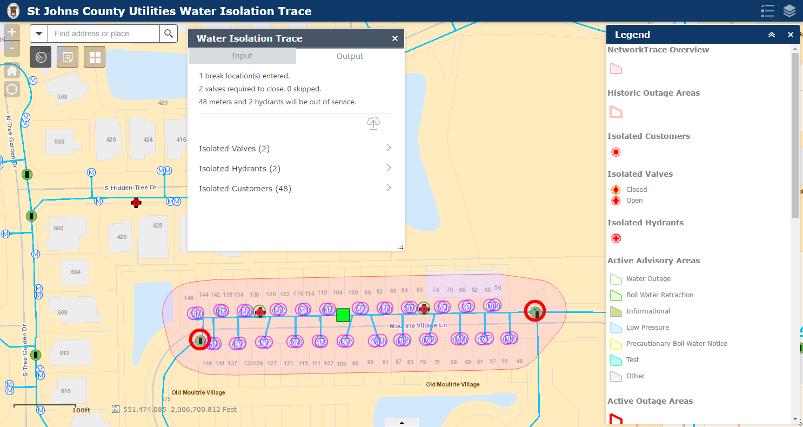

# Equipping workers and empowering citizens with the Esri platform at St. Johns County Utilities

The power of GIS lies in it's ability to be used by anyone for 
virtually anything - its ability to truly _empower_ users at all 
levels. The ArcGIS Platform excels in this arena, providing the 
software, tools, and templates to allow organizations to 
produce applications to empower their end users. One such 
organization is the St. Johns County, Florida Water 
Utility, a provider of water, sanitary sewer and reuse water 
services to 42,000 accounts and 100,000 residents in coastal 
northeast Florida (Tibbitts, 2016). The Utilities' service area is experiencing 
new development and high growth, and as a result, in 2013 the St. Johns 
County Utility Department (SJCUD) initiated the 
development of an Integrated Water Resources Plan (IWRP) to 
implement water resources solutions through 2040. The IWRP 
indicates that by 2040, the SJCUD customer base will grow by 
88,000 people under medium-growth scenarios (St. Johns County 
Utility Department, 2015). Current growth combined with this 
anticipated future growth is and will continue to bring challenges 
of expanded capacity, replacing infrastructure, and meeting new 
regulations for water reuse and availablity requirements 
(Tibbitts, 2016). For years the Utility has embraced the capabilities of 
its GIS, but in order to meet the needs of such high growth 
and expansion, they realized a variety of solutions would needed 
to be put in place to empower both their workforce and 
customers. These solutions begin at the data level and expand 
out to web and mobile applications for data entry and analysis, service outages, 
water quality, service availability, and capital funds expenditures.

## Data

### Publication geodatabases

To meet security requirements, geodatabases were stood up with both 
read/write feature access and read-only access. Read/write feature service data is housed 
in a enterprise geodatabase separate from main production. For read-only data, a 
custom Python script utilizing the arcpy module extracts data nightly 
from the main Utility production enterprise geodatabase, replicates it to a file 
geodatabase on the web server, and rebuilds the water distribution 
geometric network, providing data to power applications for both 
in-house and external customer use. 

### Geocoder

Keeping up with new and expanding utility infrastructure in a fast-growing area is 
difficult, _locating_ a particular piece of infrastructure can sometimes be just 
as hard. With so many 
newcomers to the area, residential street construction also continues 
to rise, resulting in the need for a custom in-house local geolocator/geocoding 
service built on the latest and greatest street data based on local 
knowledge and sources. Geolocators for address points and streets are 
updated frequently and combined into a composite locator which is then 
published to ArcGIS Server and consumed in a multitude of web applications, 
ensuring that staff and end users can find even the newest of addresses 
within the service area.

## Applications

Water availability and quality are paramount for the Utility. To 
aid Utility staff with these directives, the Utility Isolation Trace  
from Esri (http://solutions.arcgis.com/utilities/water/help/web-isolation-trace/) 
was implemented within two Web AppBuilder (WAB) Developer Edition applications - 
one for field crews to use in the field for running isolation traces and 
another to be used by managers for further analyzing and disseminating the 
isolation trace results as outage information to the public.

The field application, referred to internally as "Water Isolation Trace", 
consists of a WAB Developer Edition application with the Utility Isolation Trace 
widget. It is configured against the Utility's water distribution network housed in 
the publication file geodatabase and ArcGIS Server feature services housed 
in the read/write enterprise geodatabase (Figure X). Repair crews in the field 
access Water Isolation Trace over the internet from their laptops and tablets, 
allowing them to conduct isolation traces while onsite assessing current 
conditions. Isolation trace results can be saved to the enterprise geodatabase, 
saving significant amounts of time by reducing the necessity of coordinating 
with staff back at the office. Other applications, such as Advisory Manager, 
can then consume the data.

The managerial application, Advisory Manager (Figure TT), is a clone of the Water 
Isolation Trace application, with the addition of the Esri WAB Edit widget and two 
custom widgets to work with the Utility's 
existing Code Red system (https://ecnetwork.com/community-notification/). 
Code Red is used to notify customers of outages and other potential water supply 
and quality issues. The Create Code Red tool (Figure PP) takes a outage area 
polygon from an isolation trace run and intersects it with parcel polygons to 
prepare a notification area. The Extract Code Red Tool is a custom WAB widget powered 
by a slightly modified version of the Esri Extract Data script tool from the Server 
Tools Toolbox. This tool allows a user to select a Code Red polygon to export from 
Advisory Manager as a shapefile for import into the Code Red system (Figure OO). Code Red 
accepts the shapefile as an input, gathers all registered users in that 
area, and sends out notifications regarding the issue, helping the Utility to 
streamline their customer notification processes.

Advisory Manager is also used to manage the statuses of drinking water advisories. 
Following a recent water main break, SCJUD's Environmental Manager was able to quickly 
create a Boil Water Notice for the impacted customers and push that information 
out to the public. Once the lab tests determined that the water was safe for 
consumption it was just as easy to issue a retraction; so easy in fact that the 
retraction was issued using Advisory Manager on a mobile phone from a tennis court.
This anytime/anywhere application use makes the flow of information from the Utility to 
their customers smooth and virtually instantaneous. 

Powering applications such as these requires data - accurate and trustworthy 
data. To help insure data quality, the Utility created a Collector application 
that is a hybrid of the Map Notes and Map Change Request Collector apps. 
Named "Field Observer" (Figure YY), this app is a one-stop shop for Utility staffers to 
enter not only utility infrastructure issues from the field, but to also address data concerns 
that arise as part of ground-truthing while in the field. Conditions such as a paved-over 
valve, vegetation issue, or evidence of a leak can be captured as well as sewer, 
water, and reuse map data change requests. Field Observer allows Utility 
personnel to quickly and easily identify both infrastructure and data issues and 
get those issues logged and into the system of record where further corrective 
actions can be taken.

{#id .class width=300}

Field Observer has been used recently to increase the accuracy of GIS data and 
streamline communication between field crews and the GIS team. Field crews 
verified the location of valves and used Field Observer to note changes to 
valve locations. In the past, changes such as these were communicated using 
screenshots and a email for each valve. Now, the information is added to the 
map, which is instantly visible to GIS staff, resulting in a reduced volume 
of emails and an increased flow of information.

To notify customers of water quantity and/or quality issues, the Esri 
Drinking Water Advisory template 
(http://solutions.arcgis.com/utilities/water/help/drinking-water-advisory/) 
was deployed (https://goo.gl/q5GEDn). Boil water notices, boil water notice 
retractions, water outages, and low water pressure notices created through the 
Create Code Red tool are displayed here as Drinking Water Alerts and Advisories 
(Figure RR). 
The Alerts and Advisories layer is updated from within the Advisory Manager 
application.

 

To inform customers of services available in their area, the Esri Information 
Lookup template was implemented as the Customer Services Summary application 
(https://goo.gl/VZ7Zw9). Users can click on the map or search by address (using the custom 
in-house geocoding service) to get a list of services, contacts, and other 
information for that location (Figure QQ) such as water quality reports, 
irrigation regulations, and utility rates.

Keeping their customer base up to date on future projects and expenditures 
is important to any utility. To help with this a public-facing Capital 
Improvement Projects (CIP) site (https://maps.sjcutility.us/cip/) was 
created using the Esri Story Map Tour template customized with a tabbed 
layout for viewing reuse, water, and sewer capital improvement projects by category (Figure AA). 
The Utility had powered Story Maps in the traditional methods in the past (CSV file, hosted 
feature services), but wanted to be able to drive this CIP Story Map dynamically 
from a enterprise geodatabase backed feature service. With this setup, Utility 
GIS staff can add content to the Story Map simply by adding new CIP features 
and/or changing a status in the data with no need to touch the application or 
any items in its ArcGIS Online (AGO) backend. With this application, the 
public can learn where capital investments are being made in the county and 
what the investment can do for them.

An internal-only AGO web application was also stood up to keep Utility staff 
informed of current and future CIPs. Although simply a viewer, this internal 
app shows all CIPs and provides full access to data attributes and full-resolution 
photographs (Figure SS).

After Hurricane Matthew hit the area in early October 2016, the Utility was able 
to quickly deploy applications to aid in recovery. A Damage Assessment tool was used 
to quickly assess damage to approximately 360 liftstations 
in a matter of days. Teams equipped with tablets began assessments on a Tuesday and were 
done by Thursday. Liftstation conditions were quickly recorded, including 
photographs of any damage. Information gathered with this tool was used for documentation 
for FEMA reimbursement.

To demonstrate the sheer volume of work completed during and after the hurricane, a 
time line application was built and has been used in various presentations to demonstrate 
the speed at which issues were addressed and resolved.

## Conclusion

St. Johns County Utilities is using the Esri Platform to enable their workforce and 
empower their customers. By putting the right tools, maps, and applications into 
the hands of their field workforce, they are able to in turn provide 
quality data, up-to-date information, and timely and accurate 
notifications to their customers. With the help of a healthy GIS, 
the Utility will be able to keep up with rapid growth in a fast-changing 
world. In the aftermath of natural disaster, GIS applications helped power and 
aid the recovery effort. Even though the Utility is a mature GIS shop, they 
continue discovering new ways to utilize GIS and the Esri Platform.

## Acknowledgements

The author would like to thank Tom Tibbetts and Bryan Bommersbach at 
St. Johns County Water Utilities for their help with this article and 
Michael Parma of GISinc for being a pretty awesome Technical Architect.

## References Cited

St. Johns County Utility Department, 2015. SJCUD Integrated 
Water Resources Plan Technical Report. 
http://www.sjcfl.us/Utilities/media/IWRP/201511SJCIWRPFinal.pdf

Tibbitts, T., 2016. Technology Transforms St. Johns County Water 
Utilities, Esri News for Water and Wastewater, Summer 2016. 
http://www.esri.com/library/newsletters/water/summer-2016.pdf

## About the author

Chad Cooper has worked in the geospatial industry in technician, analyst, 
and developer roles for the past 15 years in state government, oil and 
gas, academia, and most recently, as a Solutions Engineer consulting 
on the State and Local 
government team with Geographic Information Services, Inc. (GISinc, 
http://www.gisinc.com). At work, he couldn't be happier spending the 
day writing Python and helping clients such as St. Johns County Utilities get the most 
out of their data through the use of the Esri Platform. At home, he 
enjoys hanging out with his gorgeous wife of 12 years and their three 
wonderful children. They enjoy hiking, fishing, and doing nothing on a 
nice beach.

